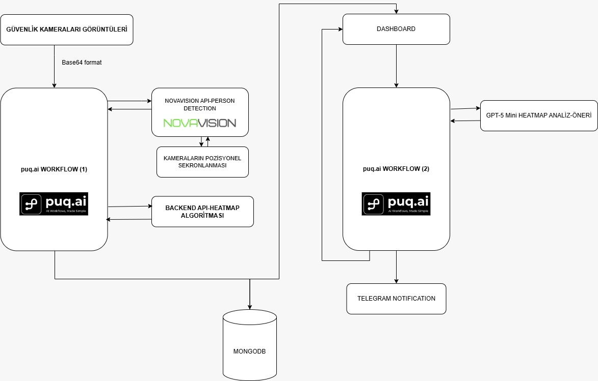

# InsightMap

InsightMap, fiziksel sahayı canlı bir dijital görünürlük katmanına dönüştüren yapay zeka destekli bir platformdur.

Platform; görüntü işleme, iş akışı yönetimi ve yapay zeka destekli karar desteğini aynı yapıda bir araya getirir.

Bu proje; **Ahmet Melih Çalış, Ahmet Enes Öztürk ve Emirhan Koçoğlu** tarafından,**Kocaeli Üniversitesi Yazılım Kulübü** ve **puq.ai ana sponsorluğunda** düzenlenen **Base 41 Hackathon** kapsamında geliştirilmiş ve **ikincilik ödülü** kazanmıştır.

## Proje Özeti

InsightMap, fiziksel sahadan gelen veriyi anlamlandırılabilir bir görünürlük katmanına dönüştürür. Böylece yoğunluk, hareket ve konum verisi; izleme, iş akışı yönetimi ve karar desteği için kullanılabilir hâle gelir.

## Konumlandırma

InsightMap şu şekilde konumlandırılmıştır:

- Fiziksel sahayı canlı dijital görünürlük katmanına dönüştüren bir platformdur.
- Görüntü işleme kullanır.
- puq.ai workflowları ile iş akışı yönetimi sağlar.
- Yapay zeka ile karar desteği sunar.

## Öne Çıkan Özellikler

- Fiziksel sahadaki yoğunluğu ısı haritası üzerinde görselleştirme
- Farklı zaman aralıklarında hareketliliği karşılaştırma
- Çoklu kamera görünümü ile sahayı tek panelden izleme
- Yapay zeka destekli yorumlama ile operasyonel öneri üretme
- Demo ortamında uçtan uca akışı simüle edebilme

## Sistem Akışı

Sistem genel olarak aşağıdaki akışla çalışır:

1. Fiziksel sahadan gelen görüntü sisteme alınır.
2. Görüntü işleme katmanı kişi ve yoğunluk verisi üretir.
3. Backend bu veriyi işleyerek heatmap için gerekli veri katmanını hazırlar.
4. Üretilen veri MongoDB üzerinde saklanır.
5. Dashboard üzerinde ısı haritası gösterilir.
6. Yapay zeka katmanı, heatmap verisini yorumlayarak öneri ve karar desteği üretir.

## Mimari

InsightMap mimarisi iki ana iş akışı etrafında kurgulanmıştır:



### Workflow 1: Görüntü İşleme ve Veri Üretimi

1. Güvenlik kamerası görüntüleri sisteme base64 formatında alınır.
2. Bu veri `puq.ai Workflow (1)` içine aktarılır.
3. Workflow, kişi tespiti için `NovaVision API - Person Detection` katmanını kullanır.
4. Kamera pozisyonlarının senkronizasyonu sağlanır.
5. Backend API, heatmap için gerekli detection ve yoğunluk verisini işler.
6. Üretilen detection ve yoğunluk verisi MongoDB'ye kaydedilir.
7. Dashboard tarafında bu veri kullanılarak ısı haritası görselleştirilir.

### Workflow 2: Analiz ve Karar Desteği

1. Dashboard ve ısı haritasını besleyen yoğunluk verisi `puq.ai Workflow (2)` ile ikinci değerlendirme katmanına aktarılır.
2. `GPT-5 Mini`, bu veriyi yorumlayarak analiz ve öneri üretir.
3. Üretilen çıktılar dashboard üzerinde gösterilir.
4. `Telegram` üzerinden bildirim gönderilir.

## Repository Kapsamı

Bu repository, InsightMap'in doğrudan uygulama katmanını içerir:

- Dashboard arayüzü
- Node.js backend API katmanı
- Snapshot alma ve detection verisi işleme akışı
- MongoDB kayıt ve veri yapısı
- Heatmap verisinin dashboard tarafında görselleştirilmesi

`NovaVision`, `GPT-5 Mini` ve `Telegram Notification` bileşenleri sistem mimarisinin bir parçasıdır; ancak bu repoda doğrudan çalışan bağımsız servis kodu olarak yer almaz. Bu bileşenler ayrı servisler veya harici workflow katmanları olarak konumlandırılmıştır.

## Tech Stack

### Frontend

- HTML
- CSS
- Tailwind CSS

### Backend

- Node.js

### Veritabanı

- MongoDB

### Görüntü Analizi ve Orkestrasyon

- NovaVision AI
- puq.ai Workflow
- GPT-5 Mini

### Bildirim Katmanı

- Telegram Notification

### Demo / Simülasyon

- Unity

## Repo Yapısı

```text
.
├── README.md
├── docs/
│   └── insightmap-architecture.jpeg  # Mimari diyagramı
├── config.example.json               # Örnek istemci / entegrasyon yapılandırması
├── .env.example                      # Örnek ortam değişkenleri
├── index.js                          # Node.js sunucusu ve API endpoint'leri
├── package-lock.json
├── package.json
└── public/                           # Statik arayüz dosyaları
    ├── heatmap.html                  # Isı haritası görünümü
    ├── index.html                    # Açılış sayfası
    ├── login.html                    # Giriş ekranı
    ├── logo.png                      # Uygulama logosu
    ├── register.html                 # Kayıt ekranı
    ├── script.js                     # Açılış sayfası etkileşimleri
    ├── store.html                    # Saha detay ekranı
    ├── stores.html                   # Saha listesi / panel
    └── styles.css                    # Ortak stiller
```

## Kurulum

Kuruluma başlamadan önce aşağıdaki bileşenlerin hazır olması gerekir:

- MongoDB erişimi
- `puq.ai` hesabı ve (Workflow yönetimi için)
- `NovaVision` hesabı (Görüntü analizi servis erişimi için)

### 1. Bağımlılıkları yükleyin

```bash
npm install
```

### 2. Ortam değişkenlerini tanımlayın

`.env.example` dosyasını temel alarak bir `.env` dosyası oluşturun:

```env
PORT=4042
MONGO_URI=mongodb://localhost:27017/insightmap
PUQ_SYNC_HOST=api.puq.ai
PUQ_SYNC_PATH=/h/replace-this-with-your-secret-webhook/sync
```

### 3. Uygulamayı başlatın

```bash
npm start
```

Uygulama varsayılan olarak şu adreste çalışır:

```text
http://localhost:4042
```

## Notlar

- Sistem, anonim insan tespiti ve yoğunluk odaklı bir kurgu ile tasarlanmıştır.
- Bu repoda ısı haritasının görsel çizimi frontend tarafında yapılır; backend ise bu görselleştirme için gerekli veriyi işler ve sunar.
